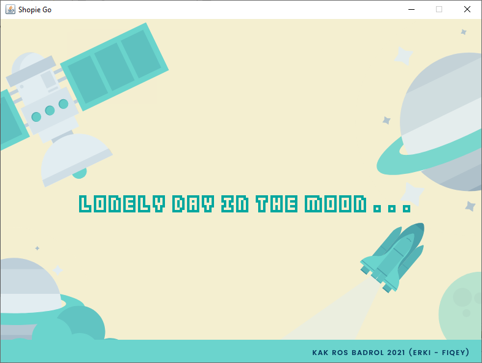
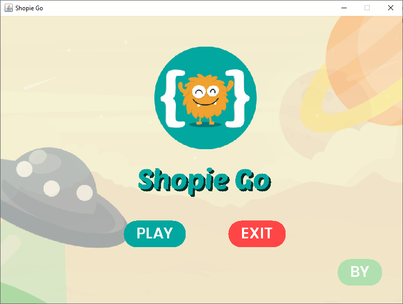
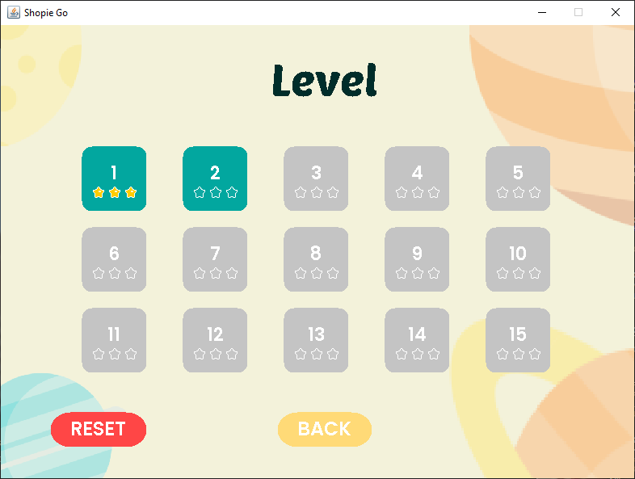
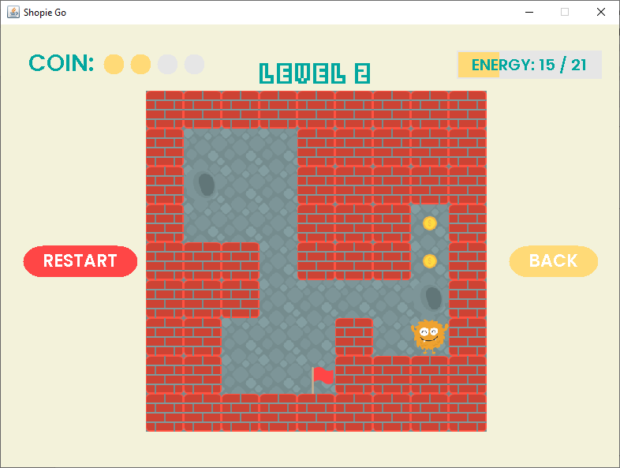
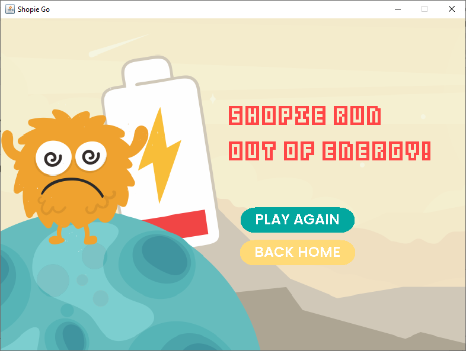
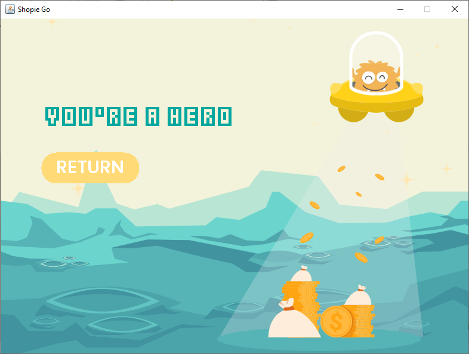
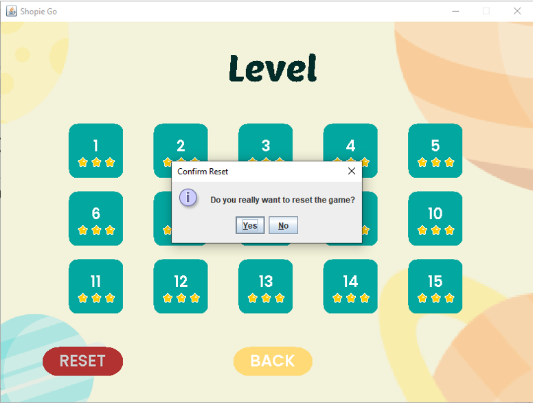
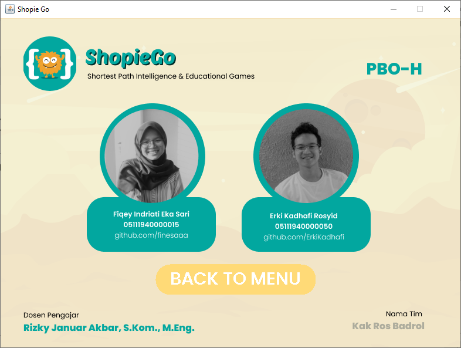

# SophieGo
✨FINAL PROJECT 
Pemrograman Berorientasi Objek Kelas H
by Tim Kak Ros Badrol

### Anggota Kelompok:  
🛸 Fiqey Indriati Eka Sari - 05111940000015   
    username  : finesaaa

🛸 Erki Kadhafi Rosyid - 05111940000050   
    username  : ErkiKadhafi

### Deskripsi Game
ShopieGo adalah game edukasi yang memiliki tujuan untuk menjalankan player agar
mendapatkan semua koin dan mencapai tujuan (bendera) dengan langkah seefisien dan
sesedikit mungkin (sorthest path).

ShopieGame dapat menyimpan progress permainan dengan memanfaatkan .txt, sehingga setelah play the game and exit window,
user dapat melanjutkan permainan sebelumnya.
Jika ingin mereset progress permainan dapat dilakukan dengan menekan tombol reset pada Tampilan LevelSelector.
[Jika tidak terupdate, clean project ya :) biar reload txt nya]

### Struktur Kelas 
>📁 algo     :
ShortestPath.java

>📁 entities :
Level.java

>📁 gfx      :
Assets.java, Text.java

>📁 handler  :
KeyboardHandler.java dan MouseHandler.java
 
>📁 helper   :
FontLoader.java, ImageLoader.java, LevelLoader.java, LevelWriter.java

>📁 main     :
Window.java

>📁 shopie   :
Player.java

>📁 states   :
CongratsState.java, CreditsState.java, GameOverState.java, LevelSelectorState.java, LoadingState.java, MenuState.java, ResultState.java, State.java

>📁 ui       :
Button.java, Click.java, CoinPanel.java, LevelButton.java, StepCounterPanel.java 

### Layar Game

#### Loading State

#### Menu State

#### LevelSelector State

#### Level 

#### Result State

#### Game Over State

#### Congrats State (THE END)

#### Reset The Game

#### Credit State

